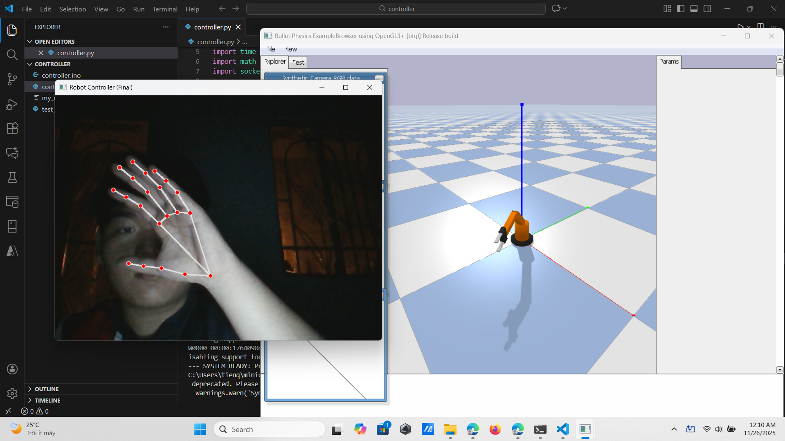
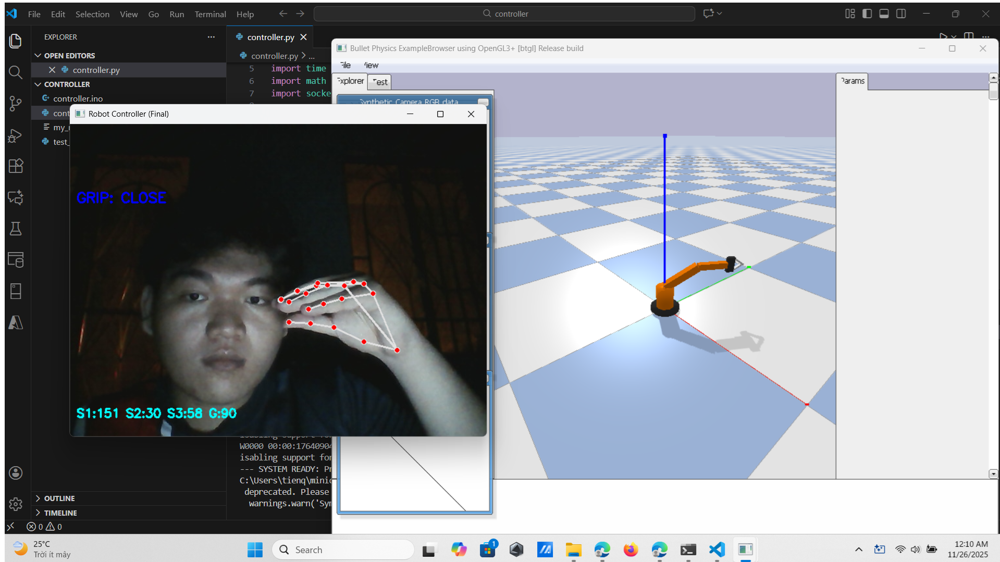

# HandTrack-RoboArm (PyBullet + ESP32)

> A 4-DOF robotic arm controlled by **hand tracking** (MediaPipe), with **PyBullet simulation** and **real hardware control via ESP32 + PCA9685**.




---

## 1. Overview

This project integrates:

1. **Hand gesture detection** using MediaPipe + OpenCV.
2. **Robot simulation** in PyBullet using a custom URDF.
3. **Real hardware control** through ESP32 (UDP) → PCA9685 → servo motors.

Workflow:

1. Camera captures the hand.
2. MediaPipe extracts landmarks → estimate end-effector target in 3D.
3. PyBullet computes joint angles via **inverse kinematics**.
4. Python sends servo angles (UDP) to ESP32.
5. ESP32 smooths the motion and outputs PWM to control real servos.

---

## 2. Folder Structure

```text
robot_arm/
├── controller/
│   ├── controller.ino        # ESP32 code: WiFi + UDP + PCA9685
│   ├── controller.py         # Main Python pipeline (vision → IK → UDP)
│   ├── my_robot.urdf         # URDF model
│   └── test_servo6.py        # Servo test script
│
├── simulator/
│   ├── my_robot.urdf         # URDF for simulation
│   └── robot.py              # Standalone PyBullet demo
│
└── test/
    ├── test_wifi/test_wifi.ino
    ├── test_servo/test_servo.ino
    ├── test_servo_6/test_servo_6.ino
    ├── test_chip/test_chip.ino
    ├── servo_controller.ino
    ├── test.ino
    └── Da ket noi thanh cong!.txt
```

---

## 3. Main Components

### `controller.py`
Handles the full pipeline:

- Loads PyBullet simulation + URDF
- Uses MediaPipe Hands for gesture recognition
- Computes end-effector target position
- Runs inverse kinematics → joint angles
- Sends formatted UDP data:

```
1:<deg1>,2:<deg2>,3:<deg3>,4:<deg4>,G:<0|90>
```

- Gesture rules:
  - **Hand fully open → RESET HOME**
  - **Thumb–index distance → open/close gripper**

### `controller.ino`
- Connects ESP32 to WiFi
- Listens for UDP packets
- Parses angle values
- Sends smooth PWM outputs via PCA9685
- Uses `currentAngle[] → targetAngle[]` interpolation to reduce jerk

---

## 4. Requirements

### Hardware
- ESP32 dev board  
- PCA9685 16‑channel PWM driver  
- 4–5 servo motors (SG90 / MG90S)  
- External servo power supply  
- Custom 4‑DOF robotic arm frame  

### Software
Python:
```
opencv-python
mediapipe
pybullet
pybullet_data
```

Arduino IDE:
- ESP32 boards package
- Adafruit PWMServoDriver library

---

## 5. Setup

### A. Flash ESP32 (`controller.ino`)

1. Update WiFi:
```cpp
const char* ssid = "YOUR_WIFI";
const char* password = "YOUR_PASSWORD";
```

2. Update servo channels:
```cpp
#define CH_S1 2
#define CH_S2 3
#define CH_S3 4
#define CH_S4 5
#define CH_GRIPPER 6
```

3. Upload to ESP32  
4. Use Serial Monitor to get ESP32 IP

---

### B. Python Controller (`controller.py`)

1. Install dependencies:
```bash
pip install opencv-python mediapipe pybullet
```

2. Configure ESP32 target:
```python
ESP_IP = "192.168.x.x"
ESP_PORT = 1234
```

3. Adjust servo offsets/directions:
```python
OFFSET_1 = 90
DIR_1 = 1
# ...
```

4. Ensure `my_robot.urdf` is in correct path.

---

## 6. Usage

### Simulation Only

```bash
cd simulator
python robot.py
```


*(Add a real PyBullet screenshot)*

---

### Real Robot + Simulation

```bash
cd controller
python controller.py
```

Gestures:
- Move hand → moves end-effector
- Open palm → reset to HOME
- Pinch → close gripper  
- Spread → open gripper


*(Add a photo of the real robot performing motion)*

---

## 7. UDP Packet Format

Example:
```
1:87,2:112,3:65,4:90,G:0
```

- `1–4`: servo angles (0–180°)
- `G`: 0 = open, 90 = closed

ESP32 smoothing:
- Interpolates via `K_SMOOTH`
- Prevents servo jitter

---

## 8. Further Improvements

- Add advanced gestures (pinch-depth, multi-finger modes)
- Improve IK stability
- ROS2 bridge
- Add PID smoothing on ESP32
- Auto‑calibration routine for servo offsets
- Integrate depth camera

---

## 9. Recommended Project Name

**Suggested repo name:**  
### 👉 HandTrack-RoboArm

Other options:
- VisionArm-ESP32  
- MediArm-Control  

---

## 10. Media Placeholder Section

Place your files inside:

```
docs/
 ├── demo_placeholder.jpg
 ├── simulation_placeholder.jpg
 └── real_robot_placeholder.jpg
```

You can replace them with:
- GIFs of hand tracking  
- PyBullet screenshots  
- Real robot movement photos  

---

## 11. Notes

- Avoid publishing real WiFi credentials in GitHub.
- Recommend adding a wiring diagram and assembly photo.

---

